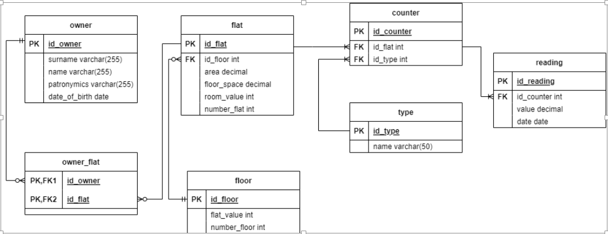

# housing
необходимо реализовать информационную систему для работы ТСЖ
Функционал: работа с квартирами, владельцами, счетчиками

## База данных
Модель базы данных представлена ниже:

## Основной функционал
- просмотр всех владельцев
- просмотр всех квартир
- CRUD операции для владельца, квартиры, показаний счетчиков и т.д.

---
К времени 16:52 18 августа 2023 реализована большая часть запросов, но веб-интерфейс присутствует только для просмотра владельцев и квартир
Остальные запросы выполняются (Запросы на редактирование, добавлени и удаление). Протестированы в Postman

результат работы приложения на текущий момент:

## Стек технологий
- Java 19 SE
- Apache Maven
- Apache Tomcat
- PostgreSQL
- Spring Boot
- Spring Core
- Spring Data
- Spring MVC
- Hibernate
- Lombok
- TypeScript
- Angular
- HTML
- CSS

---
## На будущее
На текущий момент продолжается разработка дальнейшего функционала системы
В планах расширить веб интерфейс и добавить:
- поиск владельцев и квартир по фильтрам
- просмотр информации об этажах
- добавление данных (счетчики, квартиры, владельцы)
- создание системы регистрации (админ, пользователь) с различным интерфейсом
- расширить функционал:
    - добавить сущность "Дом"
    - добавить схему этажа в виде картинок 
